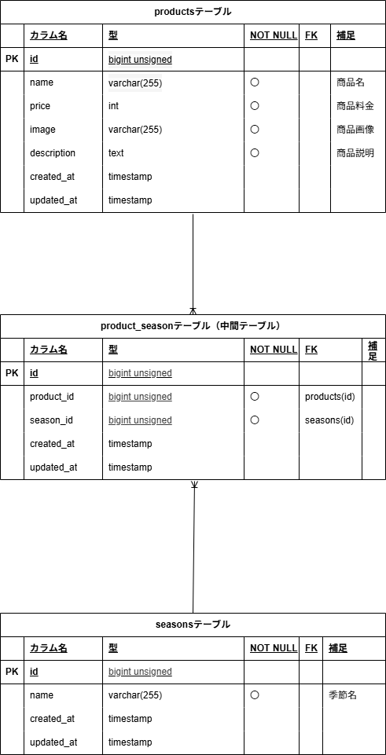

# Mogitate

  
## 環境構築  
  ubuntsu仕様にて構築  

## Dockerbuild  
  - git clone git@github.com:ErikoKikuchi/test-mogitate.git  
  - cd test-mogitate  
  - git remote set-url origin 作成したリポジトリのurl  
  - docker-compose up -d --build  

## Laravel環境構築
  - docker-compose exec php bash  
  - composer install  
  - composer create-project "laravel/laravel=8.*" . --prefer-dist  
  - sudo chmod -R 777 src/*(windowsの場合)  
  - 開発環境ではAsia/Tokyoに設定済  
  - cp .env.example .env  
  -- DB_HOST=mysql,  
  -- DB_DATABASE=laravel_db,  
  -- DB_USERNAME=laravel_user,  
  -- DB_PASSWORD=laravel_pass  
  - php artisan key:generate  
  - php artisan migrate  
  - php artisan db:seed  

## 開発環境
  - 商品一覧画面：http://localhost/products  
  - (画面フロー )各商品カードを押下で商品詳細画面  
  - (画面フロー )「＋商品を追加」ボタンを押下で商品登録画面  

## 使用技術（実行環境）  
  - php:8.1-fpm（Dockerfile）
  - Laravel：8.75
  - MySQL:8.0.26
  - nginx:1.21.1

## データベース設計  
### ER図  
  -   
